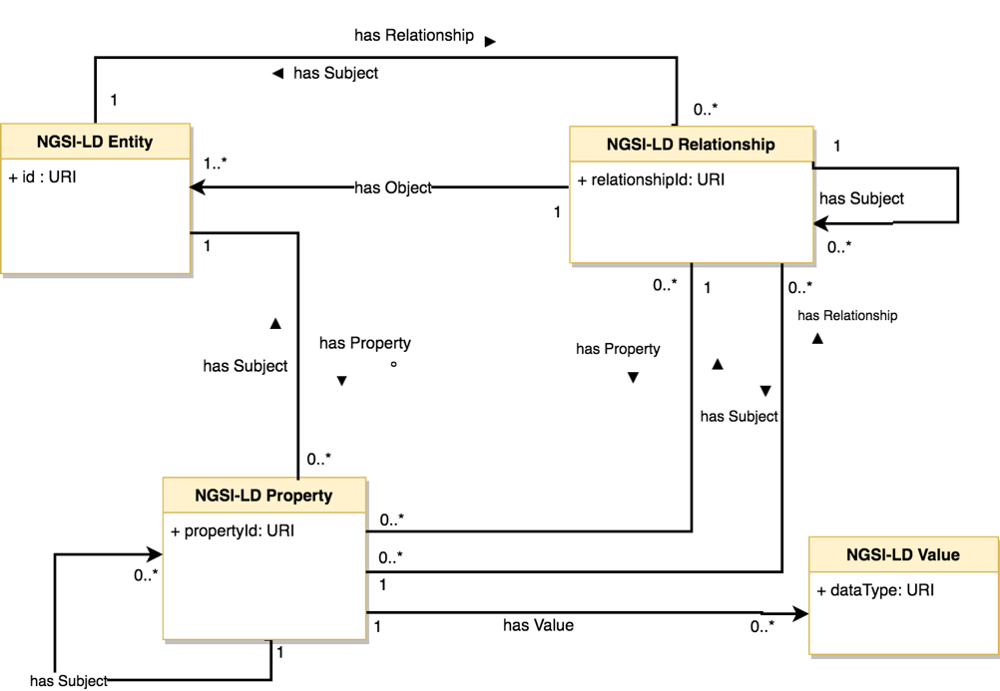

# NGSI-LD Information Model (NGSI-LD 情報モデル)

下の図は、NGSI-LD 情報モデルの UML 図を示しています。

NGSI-LD 情報モデルには、**Entities** (エンティティ), **Properties** (プロパティ) と **Relationships** (リレーションシップ)があります。エンティティ (インスタンス)は、他のプロパティまたはリレーションシップの対象にすることができます。従来の NGSI データモデルでは、プロパティは属性(プロパティ)とその値の組み合わせとして見ることができます。リレーションシップを使用すると、JSON-LD の規約を使用してインスタンス間に "リンク" を確立できます。実際には、これらは NGSI 属性に似ていますが、同じシステム内または外部に存在する別のエンティティを指す URI である特別な値 (`object` という名前) を持ちます。それらは、[FIWARE データモデル](http://schema.fiware.org) に存在する "ref" 属性に幾分類似しています。

プロパティ および リレーションシップは、他のプロパティまたはリレーションシップの対象にすることができます。したがって、NGSI-LD 情報モデルでは、属性のメタデータはなく、単に "プロパティのプロパティ" となります。無限のグラフを持つことは期待されておらず、実際には、1つまたは2つのレベルの特性または関係の "連鎖" しか生じません。通常、NGSI メタデータ抽象化に相当するものが存在します。

インスタンス化の例は、[ここ](example.md) で見ることができます。

