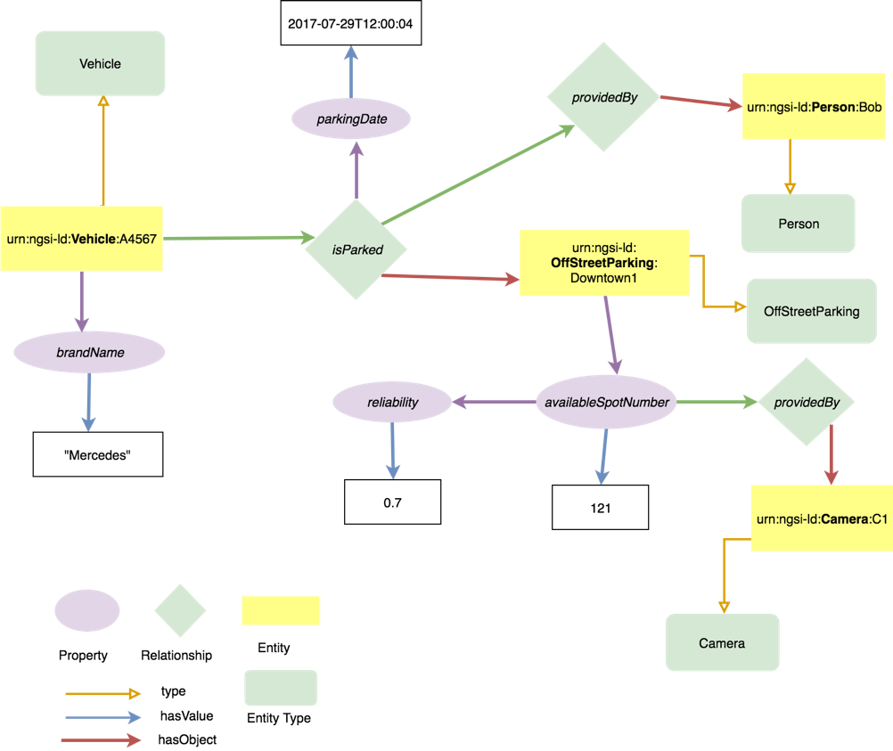

# NGSI-LD のインスタンス化の例

次の図は、NGSI-LD 情報モデルのインスタンス化の例を示しています。これは、特定の駐車場 (OffStreetParking タイプのエンティティ) に駐車されている Vehicle タイプのエンティティのインスタンスが存在することを伝えます。これらのエンティティに関するさまざまなプロパティが提供され、プロパティの追加プロパティ (タイムスタンプなど) またはリレーションシップのプロパティ (parkingDate) が記述されます。

説明されているエンティティに対応する JSON-LD 表現が[ここ](example-code.md)にあります。

