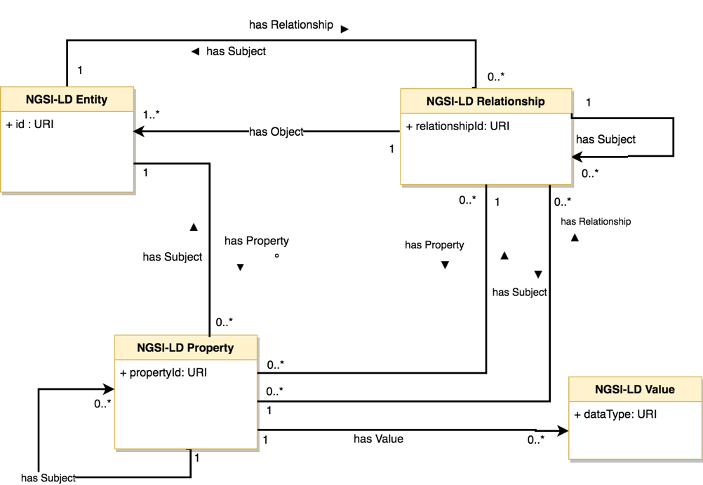

# NGSI-LD Information Model

The figure below shows a UML diagram of the NGSI-LD information model.

In the NGSI-LD information model, there are **Entities**, **Properties** and **Relationships**. Entities (instances) can be the subject of other Properties or Relationships. In terms of the traditional NGSI data model, Properties can be seen as the combination of an attribute (property) and its value. Relationships allow to establish "links" between instances using JSON-LD conventions. In practice, they are similar to NGSI attributes, but with an special value (named `object`) which happens to be a URI which points to another entity residing in the same system or externally. They are, somewhat, similar to the “ref” attributes present in the [Fiware Data Models](http://schema.fiware.org).

Properties and Relationships can be the subject of other Properties or Relationships. Thus, in the NGSI-LD information model there are no attribute’s metadata but just “properties of properties”. It is not expected to have infinite graphs and in practice only one or two levels of property or relationship “chaining” will happen. Typically, there will be one, equivalent to the NGSI metadata abstraction. 

An example of instantation can be found [here](example.md). 

