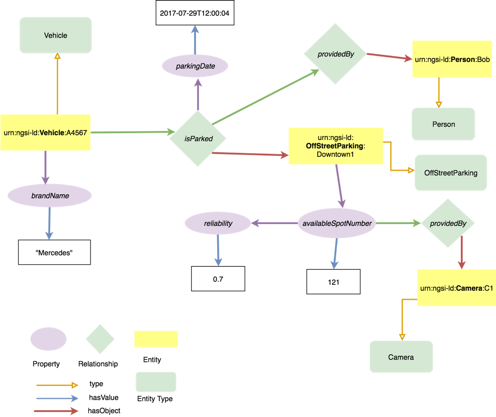

# NGSI-LD Information Model

The figure below shows a UML diagram of the NGSI-LD information model.

The following figure shows an instantiation example of the NGSI-LD information model. It conveys
that there is an instance of an entity of type Vehicle which is parked at a certain parking house
(entity of type OffStreetParking). Different properties about those entities are provided and
additional properties of properties (for instance, a timestamp) or properties of relationships
(parkingDate) are described.

